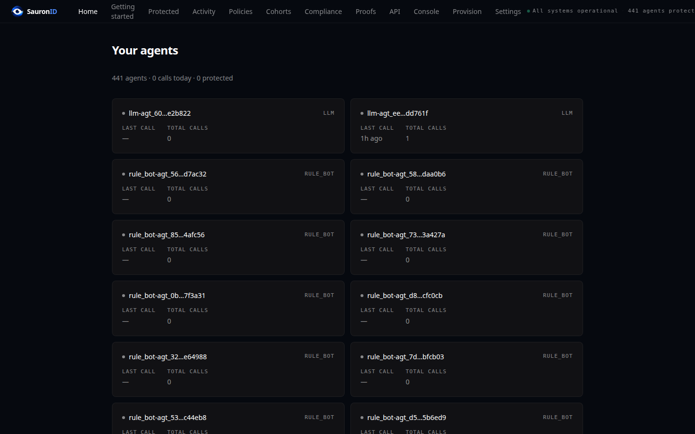
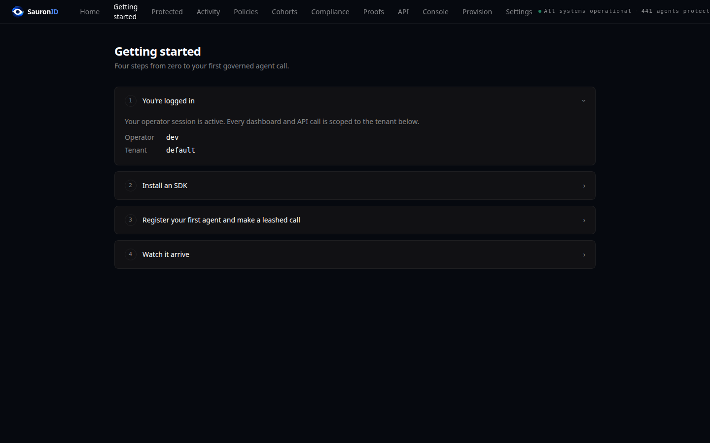
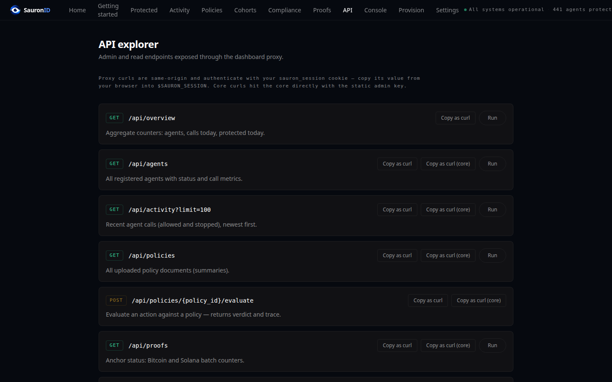

# SauronID

**A fail-closed authorization and verifiable-audit boundary for AI agents.**

[](https://github.com/tejoker/SauronID/actions/workflows/test.yml)
[](https://github.com/tejoker/SauronID/actions/workflows/security.yml)
[](https://github.com/tejoker/SauronID/actions/workflows/release-gate.yml)
[](LICENSE)

## Build and try the source release

```bash
git clone https://github.com/tejoker/SauronID sauronid && cd sauronid
docker compose up        # core :3001 + dashboard :3000 + seeded demo tenant
```

The evaluation stack is **fail-closed by default**: unsigned or tampered calls
are refused, not logged. `SAURON_REQUIRE_CALL_SIG=0 docker compose up` switches
the signature layer to advisory for a first integration — in that mode an
unsigned call returns 200, so it is not what you should judge the product on.

Then leash your first agent (Python shown; same 15 lines in
[TypeScript](sdk/typescript/README.md) and [Go](sdk/go/sauronid/README.md)):

```python
# from the repository: python -m pip install -e ./sdk/python
from sauronid_client import SauronIDClient, register_llm_agent

client = SauronIDClient(base_url="http://localhost:3001")
auth = client.user_auth("alice@sauron.dev", "pass_alice")   # seeded demo user
agent = register_llm_agent(
    client,
    user_session=auth["session"],
    user_key_image=auth["key_image"],
    model_id="claude-opus-5",
    system_prompt="You are a research assistant.",
    tools=["search", "fetch"],
)

# Every agent.call() is Ed25519-signed over method, path, body, timestamp, a
# one-use nonce and the agent's config digest.
ok = agent.call("GET", f"/agent/{agent.agent_id}")
print("signed  :", ok.status_code)          # 200

# The same client, one line later, with the per-call signature withheld — on a
# route the gateway enforces:
denied = agent.call("POST", "/agent/action/challenge", json_body={}, skip_sig=True)
print("unsigned:", denied.status_code, denied.json()["error"]["code"])
# 401 call_sig_missing_header
# .json()["error"]["fix"] names the exact headers that were missing.
```

That second call is the product. A tampered body, a replayed nonce, a drifted
config digest and a wrong-key signature are refused the same way, each with a
`code`, a reason and a `fix` — see the
[16-attack suite](redteam/) for one scenario per rejection.

Log in to the dashboard at `http://localhost:3000` (dev/dev) and open
**Getting started** for the guided version, or **API** for copy-as-curl access
to everything. More entry points: [`examples/`](examples/) (one folder per
framework), the [MCP server](sdk/mcp-server/) (add SauronID to any MCP-capable
agent without SDK work), and the [docs site](docs/site/).

| Console — your agents | Getting started | API explorer |
|---|---|---|
| [](docs/site/img/dashboard-overview.png) | [](docs/site/img/dashboard-welcome.png) | [](docs/site/img/dashboard-explorer.png) |

Captured from the `docker compose up` evaluation stack above with
`npm run screenshots` in [`dashboard/`](dashboard/) — real data from the seeded
tenant, not mockups.

## Why this matters

An AI agent compromised by prompt injection or hostile tools can do real damage
through otherwise valid credentials. SauronID puts an independently enforced
gateway in front of those actions: tenant-bound sessions, exact request
signatures, one-use capabilities, server-side policy evaluation, disclosure
contracts, byte and rate caps, and a tamper-evident action log.

This is containment, not a proof that an agent is benevolent. A valid but overly
broad policy still authorizes harm, and traffic that can bypass the gateway is
outside its control. Production therefore fails closed and requires the
deployment network policy in [`deploy/kubernetes/agent-network-isolation.yaml`](deploy/kubernetes/agent-network-isolation.yaml)
or an equivalent deny-by-default egress boundary.

Compliance statements are proved by the transparent RISC Zero STARK guests in
[`transparent-zk/`](transparent-zk/). They require no per-circuit setup ceremony;
customers verify receipts locally against published image IDs. The proof
certifies computation over the complete externally anchored receipt batch. It
cannot certify that a real-world event was truthful or that an event which
never entered the protected path occurred.

## What an agent under SauronID cannot do

- replay a captured A-JWT,
- mutate a request body after signing it,
- act outside its declared `intent`,
- silently swap its system prompt, tool list, or model id,
- escalate scope across delegation (parent → child),
- change an already finalized and externally anchored receipt batch without detection,
- act after revocation.

Those guarantees apply only to protected calls that cannot route around the
gateway and only within the limits encoded by the operator's policy.

## What SauronID is, and what it is not

| | |
|---|---|
| **Is** | A self-hostable Rust authorization gateway with TS, Python, and Go clients. Protected calls bind tenant, method, path, audience, query, body digest, timestamp, nonce, intent, runtime configuration, and one-use credentials. Finalized action batches can back native transparent STARK statements and external timestamp proofs. |
| **Is not** | A sandbox, a complete IdP, an oracle for human intent, or evidence that source data is true. It includes tenant-bound passwordless Ed25519 sessions, but SSO/SAML/social login remains an integration with the customer's IdP. |

If your AI agents call internal APIs, your customers' APIs, third-party APIs, or each other — that traffic is what SauronID binds.

## Trust model

Be honest about who you have to trust.

- Production agents register client-generated Ed25519 proof-of-possession keys;
  server-derived PoP is refused. Hardware attestation is not required for the
  authorization or STARK proof path.
- This build ships **no** hardware-attestation verifier. TPM2 and Nitro are
  archived; a claim about where a key or program executed would add
  vendor/hardware assumptions and needs real-device release evidence, and it
  never made an authorized policy safe. What remains is `ed25519_self`: an
  operator-signed runtime measurement, which is evidence about configuration,
  not about hardware.
- The STARK prover and agent process are untrusted. Verifiers still rely on the
  published guest source/image ID, RISC Zero's proof-system assumptions,
  collision-resistant hashing, and correct verifier software. This is
  cryptographic verification, not unconditional mathematics.
- A hostile process holding a valid agent key can request anything its current
  policy permits. The independent gateway, one-use capabilities, rate/amount
  caps, response-disclosure rules, and network isolation limit that authority;
  they cannot infer whether an allowed action is wise.
- Canonical trust boundaries and remaining impossibility results are maintained
  in [`docs/security/crypto/crypto-migration-boundary.md`](docs/security/crypto/crypto-migration-boundary.md).

## Verifying a release without reading this source

Verification does not depend on source access, which matters if you received
SauronID as images rather than as a repository. Three independent checks, none of
which require our cooperation — full procedure in
[`docs/security/verifying-what-you-run.md`](docs/security/verifying-what-you-run.md):

- **The image is ours.** Released images are signed keylessly at their digest
  (GitHub OIDC → Fulcio), so `cosign verify` establishes that the bytes were
  built by this repository's release workflow rather than pushed by anyone
  holding a registry token. The release workflow runs that same verification
  against its own output before completing. The signed digest is the image index,
  so it also covers the attached SLSA provenance and SBOM.
- **You run what you verified.** Deploy the digest, not the tag — a tag can be
  repointed between verification and pull. The Helm values take
  `core.image.digest` / `dashboard.image.digest`, which override `tag`.
- **The proof guests match their published source.** Both RISC Zero guests are
  published with their lock files, and `transparent-zk/verify.sh` — the same
  script the release gate runs — rebuilds them in a pinned container and fails
  if the image IDs differ from
  [`transparent-zk/image-ids.json`](transparent-zk/image-ids.json) by one bit.
  The containerised build is what makes that reproducible: a guest compiled
  directly on a host embeds its absolute paths, so the ID would otherwise depend
  on which directory it was built in.

What none of that establishes: that an instance **somebody else operates** runs
the image it claims to. Self-hosting closes that gap because you start the
process; a managed instance needs hardware attestation of the gateway, which is
scoped but not built — see
[`attestation-scope.md`](archive/removed-2026-08/hardware-attestation/attestation-scope.md). A self-reported version
string is not evidence and is deliberately not offered as one.

## What ships, what's partial, what doesn't yet exist

Honest table. Re-verifiable from the source.

### Implemented security path

- Client-generated per-agent Ed25519 PoP keys. The optional `ed25519_self`
  attestation binds an operator-signed runtime measurement to the issued
  challenge and the PoP key.
- A-JWT (intent + checksum + delegation depth) with single-use JTI.
- Versioned per-call signature over tenant, method, path, canonical query,
  audience, body digest, timestamp, nonce, JTI, and runtime configuration.
- **Owner-signed mandates.** A grant is signed by the human owner's key over
  tenant, owner key image, agent key, PoP thumbprint, intent and TTL. The
  operator cannot mint or widen a grant for an agent it hosts, because it does
  not hold the owner key. Required by default in production
  (`SAURON_REQUIRE_OWNER_MANDATE`).
- **Default-deny call-signature enforcement.** The requirement is a global
  middleware decision, not a per-route opt-in, so a new route is protected the
  moment it exists. Eight paths are explicitly exempt and enumerated in
  `CALL_SIG_EXEMPT_PATHS` — registration and challenge issuance, where the
  caller cannot yet sign, public verification surfaces, and the anonymous
  ring-policy routes, where a per-call signature would carry the very
  `x-sauron-agent-id` the ring signature exists to withhold.
- **Hash-chained per-action receipts.** Each receipt carries `seq`, `prev_hash`
  and the owner-mandate hash, so removing or reordering one breaks the chain.
  The chain-hash domain is versioned, so extending the receipt shape does not
  invalidate chains written by an earlier version.
- **Reproducible guest image IDs.** The published IDs are generated by a
  containerised build at a fixed path and verified byte-for-byte in CI, so a
  customer can reproduce them from source instead of taking the number on trust.
- **Signed release images.** Keyless signing at the digest, verified by the
  release workflow itself before the release completes.
- Server-computed agent checksum from typed `agent_type` + `checksum_inputs`. Operators cannot supply a fake checksum.
- Per-call `x-sauron-agent-config-digest` header check: agent runtime cannot drift from registered config without rejecting on every call.
- Atomic single-use TOCTOU patterns on every consume table (payment authorization, call-nonce, JTI).
- Constant-time HMAC compares (no timing oracles).
- CORS hard-fail on empty origins (no permissive fallback).
- Sliding-window rate limits per agent + per human.
- Complete v2 Merkle commitment of action receipts → Bitcoin
  (OpenTimestamps) + Solana (Memo), with authoritative tenant-scoped proof
  checkpoints.
- Native RISC Zero `Succinct` STARK verification for stats and
  action-policy statements. Fake, Groth16-compressed, unknown, wrong-program,
  wrong-tenant, and wrong-checkpoint receipts fail closed.
- Tenant-bound passwordless user challenge/response using an Ed25519 key, with
  short-lived one-use challenges and signed sessions.
- Telemetry: `tracing` (JSON or pretty), Prometheus `/metrics`, structured logs.
- Background GC for 5 expirable tables.
- In-band egress capability gateway: exact host/method/path constraints,
  request/response disclosure modes, allowed-header and byte caps, DNS/SSRF
  checks, redirect refusal, credential brokerage, one-use capabilities, and
  rate buckets. Production rejects bare-host policies.
- Python client (`sdk/python/sauronid_client/`) with LangChain, LlamaIndex, CrewAI, AutoGen, OpenAI Assistants, and Anthropic tool-use adapters, plus a generic `wrap()`.
- TypeScript client (`sdk/typescript/src/`) with the same signed-call flow and Vercel AI / OpenAI / Anthropic adapters; Go client (`sdk/go/sauronid/`) with the same flow.
- MCP server (`sdk/mcp-server/`) exposing the leash as tools to any MCP client.
- SQLite online-backup verification and restore-integrity tooling for the
  supported single-node topology.

### Partial — works but operator must complete

- **Database topology**: `SAURON_DB_BACKEND=postgres` + `DATABASE_URL` moves the
  whole deployment to PostgreSQL — every call site, not a subset. `DbHandle::lock()`
  returns a dispatching guard, so the SQLite pool is a dev default rather than a
  sidecar, and `core/tests/postgres_backend_drift.sh` fails if a registration
  lands in it. The 38 remaining `lock_sqlite()` opt-outs are enumerated and
  pinned by `core/tests/postgres_dispatch_coverage.rs`; 34 of them are the SQLite
  half of `Repo`'s own two-armed match, whose other half is sqlx. Underneath,
  `sql_translate.rs` rewrites the narrow SQLite dialect this codebase uses and
  `any_db.rs` gives one row/parameter abstraction over both backends — pinned by
  a dual-backend equivalence test and a SQL differential test against a real
  PostgreSQL in CI. On SQLite, production startup still requires explicit
  acceptance of the single-node topology; on Postgres that gate does not apply.

  **What that does and does not buy you.** Measured, single host, in
  the load harness in `redteam/`: PostgreSQL sustains **2,274 rps over
  15 minutes with 0 errors across 2.05M requests**, and its p99 stays flat
  (15.9 ms → 18.3 ms). The same workload on SQLite manages 636 rps with p99
  drifting **monotonically 105.7 ms → 301.5 ms** and ~5.2 s max spikes, because
  the nonce table and the data file grow under it. So the Postgres tier is
  ~3.6× the throughput with a tail that does not degrade.

  That is a throughput claim on one core process against one PostgreSQL
  instance. It is **not** an HA claim: nothing here tested replica failover,
  partition behaviour, or multi-replica contention on the same tables, and
  `high_availability` stays `false` in `release/manifest.json` until it is. Two
  connection pools are opened per replica — the async sqlx pool and the blocking
  one every `lock()` site uses — so budget `SAURON_PG_POOL_SIZE +
  SAURON_DB_POOL_SIZE` connections against the server's `max_connections`.
  Database TLS is driven by `sslmode`; see
  `deploy/README.md`.
- **OpenTimestamps confirmation latency**: receipts are submitted instantly to public calendars; **Bitcoin block inclusion takes ~1 hour**. Solana memo finalisation is ~30 s. Dashboard surfaces three honest states per batch (ADR-001): Solana-confirmed (≤30 s), BTC-pending (≤1 h), Dually anchored. No single false "anchored" summary — both chains are reported independently on `/admin/anchor/batches` and the `/proofs` console page. Operators with stricter timing pick the Solana path or run their own calendar.
- **No human-identity surface**: the bank-KYC ingest, the end-user consent routes, the credential issuer and the legacy Groth16 circuits are archived under [`archive/removed-2026-08/`](archive/removed-2026-08/). SauronID binds agents, not humans. No sanctions/PEP screening is shipped and none is stubbed.
- **External key custody**: production secret resolution and external partner-key
  custody are fail-closed configuration obligations. Vault loopback behavior is
  covered by tests, but the deployment must supply, authorize, rotate, and
  recover its real secret backend.
- **No hardware tier**: the TPM2 and Nitro verifiers are archived under
  [`archive/removed-2026-08/hardware-attestation/`](archive/removed-2026-08/hardware-attestation/).
  No deployment used them and neither was release-ready without real-device
  evidence. `SAURON_REQUIRE_HARDWARE_ATTESTATION=1` now fails closed with that
  explanation rather than letting an operator signature pass as hardware trust.

### Cannot do — out of scope by design

- Prove that an unobserved real-world event happened or that submitted source
  data was truthful. It proves computation and completeness relative to the
  finalized protected receipt batch.
- Determine that every syntactically valid encoded payload is semantically free
  of sensitive data.
- Prevent damage which an operator's policy deliberately or accidentally
  authorizes.
- Protect calls which can bypass the gateway at the network layer.
- Multi-region without operator effort. Single-binary deploys are vertical scaling only.
- Prove the absence of unknown vulnerabilities or replace an independent
  cryptographic review, penetration test, and deployment audit.

## SDKs and integrations

Same 15-line path in every language: `client` → `user_auth` → `register_llm_agent` → `agent.call()`.

| Surface | Install | Adapters |
|---|---|---|
| [Python](sdk/python/sauronid_client/) | `python -m pip install -e ./sdk/python` | LangChain, LlamaIndex, CrewAI, AutoGen, OpenAI, Anthropic — or `sauronid_client.wrap(...)` for one-import wrapping |
| [TypeScript](sdk/typescript/) | `npm ci --prefix sdk/typescript` | Vercel AI SDK, OpenAI tool calls, Anthropic tool use |
| [Go](sdk/go/sauronid/) | `cd sdk/go/sauronid && go test ./...` | Local policy guard + full signed-call flow |
| [MCP server](sdk/mcp-server/) | `npm ci --prefix sdk/mcp-server && npm run build --prefix sdk/mcp-server` | Any MCP client — seven tools (status, register, payment, leashed fetch, egress log, receipts, revoke) |

The per-call signature is DPoP-style by construction; an RFC 9449 DPoP
compatibility envelope is available opt-in (`SAURON_ACCEPT_DPOP=1`) for stacks
that already speak DPoP — see [docs/integration/sdk-integration.md](docs/integration/sdk-integration.md)
for the body-digest caveat. Full HTTP surface:
[`schemas/openapi.yaml`](schemas/openapi.yaml).

## Quickstart (build from source)

```bash
git clone https://github.com/tejoker/SauronID sauronid && cd sauronid
./scripts/dev/quickstart.sh
```

The script builds the Rust core and TS clients, starts the development server,
seeds test identities, and runs the invariant and empirical suites. The release
gate additionally requires all 16 empirical scenarios to execute dynamically,
pass, and report zero skips.

A cold build downloads and compiles hundreds of crates and can take roughly
15–45 minutes depending on hardware and cache state. No shorter time-to-first-
call claim is made until release containers and packages have actually shipped.

By default the server runs in **advisory** mode (logs call-signature violations but accepts them). To run in **fail-closed** (production-like) enforcement mode:

```bash
SAURON_REQUIRE_CALL_SIG=1 ./scripts/dev/quickstart.sh
```

Results produced without fail-closed enforcement are not release evidence.

For a full local demo (core + analytics shim + branded Next.js dashboard) in one shot:

```bash
./scripts/dev/launch.sh
# core      → http://127.0.0.1:3001
# dashboard → http://127.0.0.1:3000   (Mandate Console, reads the core directly)
```

To deploy, pick your scenario in [`deploy/README.md`](deploy/README.md): root `docker compose up` (evaluation), [`deploy/docker-compose.prod.yml`](deploy/docker-compose.prod.yml) (production, fail-closed pins), a **Helm chart** ([`deploy/helm/sauronid/`](deploy/helm/sauronid/)) and **Terraform module** ([`deploy/terraform/`](deploy/terraform/)) for Kubernetes, or the **no-Docker native/systemd** path in [`deploy/native/`](deploy/native/) (Caddy auto-TLS + `sauronid-core` / `sauronid-dashboard` units). The [`scripts/demo/democtl.sh`](scripts/demo/) driver wraps the native path (`build-native` → `deploy-native` → `runner` → `status`) and brings up the real LLM agent behind the Console. Full guide: [`deploy/README.md`](deploy/README.md).

## Mandate Console — the web dashboard

A branded Next.js console at `dashboard/` reads **only live data from the running core** — no parquet, no fixtures, no mocks. Main routes (nav label → code path):

| Route | What it shows |
|---|---|
| **Home** (`/`) | Live counters — total agents, calls today, protected (blocked) today — computed from real agent egress, not estimates |
| **Console** (`/try`) | The interactive console: pick a model (**local gemma** on a GPU box, or **cloud Groq**), give a real agent a task, watch it use tools and answer — then make it misbehave (replay / tamper / revoke) and watch the core reject it live (HTTP 409/401), and seal every action into Bitcoin. Every step is a real signed call to the core. |
| **Protected** (`/protected`) | Governance stops that actually happened — agent calls the core rejected (replayed nonce, tampered body, revoked agent), each with the real 4xx status. Sourced from blocked egress, never inferred. |
| **Activity** (`/activity`) | Live feed of every real agent call (allowed + stopped), filterable by agent / result / date |
| **Proofs** (`/proofs`) | Bitcoin (OpenTimestamps) + Solana anchor batches. Each batch's Merkle root is **one-click verifiable** — download its `.ots` proof and check it with the open-source `ots` tool (`ots upgrade` / `ots info`). Honest three-state surface per ADR-001 (Solana ≤30 s, BTC pending ≤1 h, dually anchored). |
| **Policies** (`/policies`) | Policy invariants bound to agents, with an evaluation endpoint |
| **Settings** (`/settings`) | Tenant + core-connection settings |

Visual grammar and component rules are in [`docs/design/design-system.md`](docs/design/design-system.md): light-first canvas (`#f7faff`), `#0054f3` for the one actionable thing, `#000d35` only where the product proves something. The applied values live with the code that imports them — [`site/styles/tokens.css`](site/styles/tokens.css) for the site, [`dashboard/app/globals.css`](dashboard/app/globals.css) for the console, which still ships the May 2026 dark palette and is not yet realigned.

## End-to-end simulation

Once the stack is up (`./launch.sh`), four scripts under [`scripts/`](scripts/) drive the full flow:

```bash
# Register N agents per seeded human + signed egress logs
python3 scripts/simulate_agents.py

# Full real action-receipt flow:
#   user_auth → agent_register (ring + PoP + intent) → A-JWT → action/challenge
#   → agent-action-tool sign-challenge → payment_authorize (per-call sig + PoP JWS)
#   → POST /admin/anchor/agent-actions/run
# Each iteration writes a row into agent_action_receipts and triggers a real
# Bitcoin OTS anchor (and Solana when SAURON_SOLANA_ENABLED=1).
python3 scripts/simulate_real_actions.py --n-actions 2

# Solana devnet keypair generation + airdrop with multi-RPC retry
python3 scripts/solana_devnet_setup.py

# Independent Solana wire-format audit (re-implements the Rust transaction
# encoder in Python and posts to devnet)
python3 scripts/solana_audit.py
```

After `simulate_real_actions.py`, the dashboard's Anchors page populates with real `agent_action_receipts`, the BTC anchor count advances, and (with Solana enabled) so does the Solana count.

## Integrate with your AI agent

```python
from sauronid_client import SauronIDClient, register_llm_agent

# `user_session` + `user_key_image` come from your end-user auth flow — the
# human owner delegating to this agent. Requires the `agent-action-tool` binary
# on PATH (or set $SAURONID_AGENT_ACTION_TOOL) for default keypair generation.
client = SauronIDClient(base_url="https://sauronid.your-company.internal")
agent = register_llm_agent(
    client,
    user_session=user_session,
    user_key_image=user_key_image,
    model_id="claude-opus-5",
    system_prompt=open("prompts/research_agent.md").read(),
    tools=["search", "fetch"],
)

# agent.call(method, path, ...) signs every request with the agent's per-call
# key (DPoP-style) and binds the config digest — a tampered body, replayed
# nonce, or drifted config is rejected server-side. Point it at any route this
# deployment serves; the signature covers whatever you send.
result = agent.call("GET", f"/agent/{agent.agent_id}")

# For leashed + on-chain-anchored actions (payments): request a
# challenge, ring-sign it with the agent's ring secret, then submit the proof.
#   proof = agent.sign_action_challenge(challenge_json)
#   agent.call("POST", "/agent/payment/authorize", json_body={..., "agent_action": proof})
```

LangChain wrapper, OpenAI Assistants wrapper, and Anthropic Computer Use wrapper in [`sdk/python/sauronid_client/`](sdk/python/sauronid_client/).

For TypeScript: [`sdk/typescript/src/`](sdk/typescript/src/).

## Empirical proof

Every claim above has a runnable test. See the suite in [`redteam/`](redteam/) for:

- 16 concrete attacks against AI-agent binding systems.
- A release-gated result in fail-closed mode: all 16 scenarios must execute
  dynamically with zero skips. This is regression evidence for those modeled
  attacks, not proof of security against unmodeled attacks.
- Comparison vs DPoP (RFC 9449), HTTP Message Signatures (RFC 9421), GNAP (RFC 9635), Anthropic MCP, Auth0 Agent Identities, AWS IAM Roles for Agents.
- Reproducible load-test configuration, raw JSON, and the observed SQLite tail-latency limitations.

To reproduce the empirical claim (requires fail-closed mode):

```bash
SAURON_REQUIRE_CALL_SIG=1 ./scripts/dev/quickstart.sh
# at the end, inspect redteam/empirical-results.json; release evidence requires
# passed == total, skipped == 0, and every result dynamic == true.
```

## Architecture (high level)

```
┌────────────┐   register   ┌──────────────────────────┐
│   Human    ├─────────────▶│   SauronID Core          │
│ (operator) │              │   (Rust, axum, sqlite/pg)│
└────────────┘              │                          │
                            │  ┌────────────────────┐  │
┌────────────┐              │  │ /agent/register    │  │
│ AI Agent   │   per-call   │  │ /agent/{...}       │  │
│  (Python /  ├──signed──▶ │  │ /agent/egress/log  │  │
│   TS / etc) │  request    │  │ /admin/anchor/...  │  │
└────────────┘              │  └────────────────────┘  │
                            │                          │
                            │  Background workers:     │
                            │   • OTS upgrader (BTC)   │
                            │   • Solana confirmer     │
                            │   • Action anchor batch  │
                            │   • GC for expirable     │
                            └──────────┬───────────────┘
                                       │
                          ┌────────────┼────────────┐
                          ▼            ▼            ▼
                   Bitcoin (OTS)   Solana       Postgres /
                   tamper-evident  Memo Tx      SQLite
                   audit anchor    audit anchor   storage
```

## Repo layout

```
core/                  Rust axum service (~50k lines under core/src)
dashboard/             Next.js Mandate Console (live data from core)
sdk/typescript/        TypeScript SDK (signed-call flow + Vercel AI/OpenAI/Anthropic adapters)
sdk/python/            Python SDK (SignedAgent + LangChain/LlamaIndex/CrewAI/AutoGen/OpenAI/Anthropic adapters)
sdk/go/                Go SDK (same signed-call flow)
sdk/mcp-server/        MCP server exposing the leash to any MCP client
examples/              Runnable examples, one folder per framework/use-case
redteam/               16-attack empirical suite + 18-attack Tavily fuzzer + competitive benchmark
contracts/             Solana Anchor program (sauron_ledger)
migrations/postgres/   Postgres schema
schemas/               Shared JSON schemas + OpenAPI spec (schemas/openapi.yaml)
transparent-zk/        RISC Zero guests (stats + action-policy), journal types, customer
                       verifier, pinned image-ids.json, and verify.sh. Self-contained and
                       published on its own so the proofs stay verifiable without this repo.
                       Both guests are on live paths: action-policy via
                       /v1/proofs/transparent/verify, stats via /v1/stats/submit-transparent
site/                  Marketing site — Next.js app (7,655 lines), separate from the
                       dashboard console. Supabase-backed early-access capture in
                       site/supabase/early_access.sql

scripts/dev/           Dev orchestration shell scripts (quickstart, launch, start, ...)
scripts/demo/          Live-demo driver (democtl.sh) + real LLM agent-runner (agent_runner.py)
scripts/               Python simulation + audit utilities (simulate_real_actions.py, solana_audit.py, ...)
deploy/                docker-compose (dev/prod/postgres), Helm chart, Terraform module,
                       AND a no-Docker native/systemd path (deploy/native/) + Solana setup
docs/                  Technical only, five folders: architecture/, security/,
                       integration/, design/, and the docs site source (site/).
                       See docs/README.md.

archive/removed-2026-08/  The four subsystems that were not agent constraint: KYC consent,
                          hardware attestation, Groth16 ZKP, cohort stats + compliance.
                          See its README for what came out and why. Do not depend on.
                          (The 2025 bank-KYC prototype that used to sit beside it is out of
                          the working tree; it lives at the archive/banking-2025 git tag.)
```


| Phase | Fichiers | État |
|---|---|---|
| `0x` le socle | 01 problèmes, 02 solution, 03 produit, 04 features | complet |
| `1x` le marché | 10 segment cible, 11 positionnement, 12 concurrents, 13 unfair advantage | 10 et 11 écrits, 12 et 13 à écrire |
| `2x` l'entreprise | 20 business model, 21 pricing, 22 unit economics | à écrire |
| `3x` l'exécution | 30 playbook, 31 hypothèses, 32 investisseurs | à écrire |

Cette table se met à jour à chaque fichier validé. Ce que le dépôt sait faire
aujourd'hui est décrit plus haut dans « What ships, what's partial, what doesn't
yet exist » et n'attend pas le company brain pour être vrai.

Comment travailler dans ce dépôt et quoi lire avant quoi : [`CLAUDE.md`](CLAUDE.md).

## Critical files

- Core service: [`core/`](core/) — Rust, axum, ~50k lines under `core/src` (recount with `find core/src -name '*.rs' -print0 | xargs -0 wc -l`).
- Mandate Console: [`dashboard/`](dashboard/) — Next.js + Chart.js, dark branded UI reading live core data only.
- TypeScript client: [`sdk/typescript/`](sdk/typescript/) — `signCall`, `register`, `popKeys`.
- Python client: [`sdk/python/sauronid_client/`](sdk/python/sauronid_client/) — LangChain + OpenAI + Anthropic adapters.
- Empirical attack suite: [`redteam/`](redteam/) — 9 invariant scenarios + 16-attack empirical suite + 18-attack Tavily fuzzer.
- Simulation + audit scripts: [`scripts/`](scripts/) — Python utilities; dev orchestration shells under [`scripts/dev/`](scripts/dev/).
- Deploy config: [`deploy/`](deploy/) — docker-compose (dev/prod/postgres) **or** no-Docker native/systemd ([`deploy/native/`](deploy/native/): `vm-setup.sh`, `sauronid-core.service`, `sauronid-dashboard.service`, Caddyfiles).
- Live-demo driver: [`scripts/demo/democtl.sh`](scripts/demo/) — build-native / deploy-native / runner / status; pairs with the real LLM agent-runner (`agent_runner.py`) behind the Console.
- Custom Solana program: [`contracts/sauron_ledger/`](contracts/sauron_ledger/) — Anchor program (optional; default uses Solana Memo).
- Transparent proofs: [`transparent-zk/`](transparent-zk/) — both guests, the customer verifier, and [`verify.sh`](transparent-zk/verify.sh), which reproduces the published image IDs in a pinned container.
- Release verification: [`docs/security/verifying-what-you-run.md`](docs/security/verifying-what-you-run.md) — the procedure to hand a customer who cannot read this source.
- Deployment: [`deploy/README.md`](deploy/README.md) — every scenario, every env var.
- Design system: [`docs/design/design-system.md`](docs/design/design-system.md) — the reference to read before touching any interface.
- Threat model: [`docs/security/threat-model.md`](docs/security/threat-model.md) — what we protect against, what we don't.
- Attack suite: [`redteam/`](redteam/) — the 16 modelled attacks, each with a runnable scenario.

## Production deployment checklist

```bash
# Deploy behind a TLS-terminating reverse proxy. The core binds plain HTTP.
# Terminate TLS in front of the core; never expose this port directly.
ENV=production
SAURON_ADMIN_KEY=$(openssl rand -hex 32)
SAURON_TOKEN_SECRET=$(openssl rand -hex 32)
SAURON_JWT_SECRET=$(openssl rand -hex 32)
SAURON_OPRF_SEED=$(openssl rand -hex 32)
SAURON_ALLOWED_ORIGINS=https://your-edge.example.com
SAURON_REQUIRE_CALL_SIG=1                        # fail-closed
SAURON_BITCOIN_ANCHOR_PROVIDER=opentimestamps    # real BTC anchoring
SAURON_SOLANA_ENABLED=1                          # dual-anchor on Solana
SAURON_SOLANA_RPC_URL=https://api.devnet.solana.com   # mainnet later
SAURON_SOLANA_KEYPAIR_PATH=/etc/sauronid/sol-key.json
SAURON_VAULT_TRANSIT_ENABLED=1                   # secret_provider abstraction; init-path wiring is roadmap (see Partial)
SAURON_REQUIRE_AGENT_TYPE=1                      # legacy fallback rejected
SAURON_DB_BACKEND=postgres                       # see docs/architecture/postgres-port-status.md
DATABASE_URL=postgres://...
```

Full guide: [`deploy/README.md`](deploy/README.md).

## Repo provenance

This codebase was started during the **Solana Colosseum 2026 hackathon**, building on a prior **2025 hackathon prototype** (preserved at the `archive/banking-2025` git tag, not in the working tree). Active development continues post-hackathon. Reviewers and auditors should rely on the implemented/partial/cannot-do boundaries above rather than infer maturity from presentation.

## Security and trust

Read before you deploy; these are the documents a security review starts from.

- [Threat model](docs/security/threat-model.md) — what is protected against, what is not.
- [Trust boundaries and impossibility results](docs/security/crypto/crypto-migration-boundary.md) — the canonical boundary doc.
- [Security policy](SECURITY.md) — how to report a vulnerability, response targets, what is out of scope.
- [Red-team matrix](docs/security/redteam-matrix.md) and the runnable [16-attack suite](redteam/).
- [SIEM integration](docs/site/guides/siem.md) — shipping the hash-chained audit trail into your stack is a config, not a project.
- CI publishes CycloneDX SBOMs on every release and runs cargo-audit, cargo-deny, gitleaks, and trivy on every push ([workflows](.github/workflows/)).
- A public audit report and bug bounty are planned once an external cryptography review lands. No such review has been completed, and no internal document is offered as a substitute.

## Contributing / development

See [CONTRIBUTING.md](CONTRIBUTING.md) for the full guide; changes are tracked in [CHANGELOG.md](CHANGELOG.md).

```bash
# Run all tests + 16-attack empirical
make verify

# Just the empirical suite
make empirical

# Cold rebuild + re-run
make clean && ./scripts/dev/quickstart.sh
```

The full session log of how this was built (multi-week, agent-driven) is intentionally not in the repo. The codebase is the spec.
